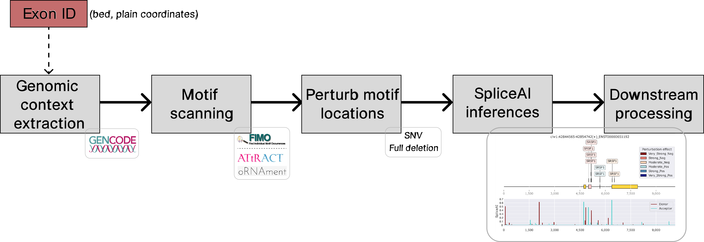
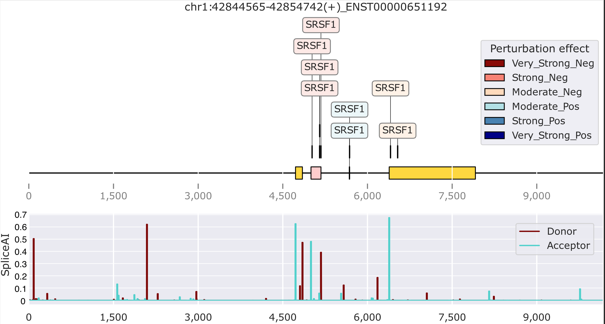

## MutSplice



A pipeline to study SpliceAI predictions via sequence perturbations at motif locations.

This is not a production-ready software, but rather a project developed in the context of a specific chapter of my PhD thesis.

### Installation

To install the package, clone the repository and run:

```
git clone https://github.com/PedroBarbosa/MutSplice.git
cd MutSplice
conda env create -f conda_environment.yml
conda activate mutsplice
pip install -e .
```

### Input format and usage

The input requires exon coordinates (1-based), a GTF cache downloadable from [here](https://app.box.com/s/zxok51g9zhsrc0l5hqpbvskxfh27t5se), and the [reference genome in fasta](https://ftp.ebi.ac.uk/pub/databases/gencode/Gencode_human/release_45/GRCh38.primary_assembly.genome.fa.gz). Having additional info on the gene name and transcript id is optional, but recommended to extract the intended transcript structure for the exon of interest. An example of suitable input tab separated file is:


| target_coordinates       | Strand | gene_name | transcript_id   |
|--------------------------|--------|-----------|-----------------|
| chr2:130161186-130161272 | -      | SMPD4     | ENST00000680298 |
| chr11:47259180-47259259  | +      | NR1H3     | ENST00000441012 |
|      ...                 | ...    | ...       | ...             |


Then, simply call:

```
from gtfhandle.utils import file_to_bed_df
from mutsplice.datasets.mutsplice_pipeline import MutSplicePipeline

df = file_to_bed_df(bed_file)
MutSplicePipeline(df,
                  do_gtf_queries=True,
                  do_motif_scanning=True,
                  do_mutations=True,
                  run_spliceai=True
                  **kwargs)
```

There are many custom settings one can add (see below). However, `gtf_cache`, `out_dir`, `fasta` are mandatory. Output files at each step will be written at `out_dir` directory. 

```
kwargs = {'gtf_cache': args.cache,
          'fasta': args.fasta,
          'out_dir': args.out_dir,
          'outbasename': args.outbasename,
          'input_feature_type': args.input_feature_type,
          'transcript_ids': args.transcript_ids,
          'motif_source': args.motif_source,
          'motif_search': args.motif_search,
          'subset_rbps': args.subset_rbps,
          'pvalue_threshold': args.pvalue_threshold,
          'min_nuc_probability': args.min_nuc_probability,
          'min_motif_length': args.min_motif_length,
          'use_full_sequence': args.use_full_sequence,
          'ss_idx_extend': args.ss_idx_extend,
          'no_batch_predictions': args.no_batch_predictions,
          'batch_size': args.batch_size,
          'spliceai_final_results': args.spliceai_final_results,
          'spliceai_raw_results': args.spliceai_raw_results}
```

Check the `--help` of `python mutsplice/datasets/mutsplice_pipeline.py` for more information on the available options.

### Output

The output are dataframes with lots of information, including the perturbation effect, location of the motif, distances to splice sites, effects on cryptic splice sites, etc. Plots like the one below are also generated, which provide a summary representation of relevant perturbations across the exon of interest:



### Running SpliceAI irrespective of exon triplet structure

To run spliceAI on flat sequences, just call directly the SpliceAI script (which accepts fasta and bed as input):

```
python mutsplice/datasets/make_inferences.py --fasta ref_genome.fa --is_flat_input --outbasename test intervals.bed out_dir
```
